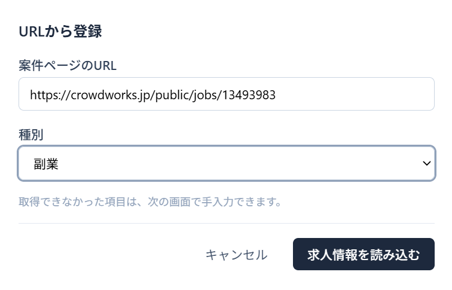
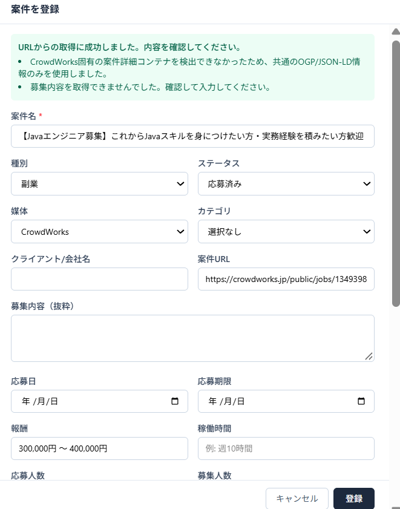
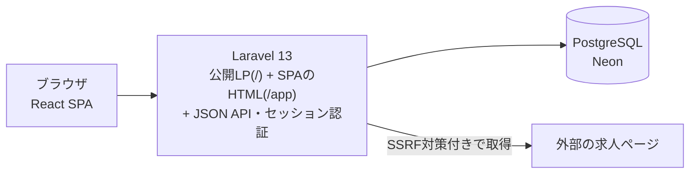

# JobHunt

[](https://github.com/muraokajade/JobHunt/actions/workflows/ci.yml)

転職と副業の求人・案件を1か所に登録し、応募後の選考状況まで管理する個人向けWebアプリです。

求人ページのURLを貼ると、サーバー側でページを取得して案件名・報酬・締切などを読み取り、登録フォームの下書きを作ります。
自分自身の転職活動で使いながら、実際に困ったことをもとに改善を続けています。

**公開URL**: [https://www.jobstockr.jp/](https://www.jobstockr.jp/)(JobHuntの紹介ページ)。「JobHuntを使う」からアプリ本体(`/app`)のログイン画面へ進みます。

## 解決する課題

| 問題 | JobHuntでの扱い |
|---|---|
| 求人が複数の媒体に散らばり、後から探し直すことになる | URL取込または手入力で1つの一覧に集める。URLから媒体を判定する |
| 求人情報を手で書き写すのが面倒 | 求人ページの構造化データ(JSON-LD)やOGPから項目を読み取り、確認・修正できる下書きにする |
| 応募後、どの企業がどの段階にいるか追えない | 転職・副業それぞれのステータスで管理し、一覧を「選考が進んでいる順」に並べる |
| 企業から後で届いた情報が残らない | 案件ごとの「活動メモ」に書き足していく |

## 主な機能

- **URL取込**: 求人URLからページを取得・解析し、登録フォームの下書きを作る(保存は確認してから)。同じURLの登録済み案件があれば警告する。ログインが必要なページは、URLを引き継いで手入力へ案内する
- **手入力**: 同じ登録フォームで全項目を入力する。新規登録のステータスは「応募済み」から始まる
- **転職 / 副業の管理**: 種別ごとにステータスの体系(転職8段階・副業12段階)と専用項目が異なる
- **ステータス管理**: 詳細画面から直接変更できる。変更は履歴としてDBに記録される
- **検索・並び順**: 「すべて / 転職 / 副業」の切り替えとキーワード検索。一覧は選考の進み具合 → 更新日時の順に並ぶ
- **詳細・編集**: 詳細はPCでは右パネル、スマートフォンでは下からのシートで表示する。登録と同じフォームで後から編集できる
- **活動メモ**: 案件ごとの自由記述欄を、詳細画面から追加・編集する
- **ゴミ箱**: 削除した案件の一覧・復元・完全削除
- **認証**: ユーザー登録・ログイン。案件はユーザーごとに分離される
- **その他**: お気に入り、次アクション(予定日)、案件0件のときの案内、架空案件で試せるデモ(閲覧専用)、スマートフォン対応

詳細: [docs/01-overview.md](docs/01-overview.md)

## 画面

| 1. 求人URLから登録 | 2. URL取得結果を確認して登録 |
|---|---|
|  |  |
| 求人ページのURLと種別を入力すると、サーバー側でページを読み取ります。 | 読み取った内容が登録フォームに入ります。取得できなかった項目は案内が出るので、確認・修正してから登録します。 |

## 技術スタック

| 区分 | 技術 |
|---|---|
| Frontend | React 19 / TypeScript 7 / Vite 8 / Tailwind CSS 4 |
| Backend | Laravel 13(PHP 8.4) |
| Database | 本番: PostgreSQL(Neon) / ローカル・テスト: SQLite |
| Authentication | Laravelのセッション認証(Cookie + CSRFトークン)。アプリ本体とAPIはログインで保護し、公開LPはログイン不要。入口用のBasic認証の仕組みもある(設定時のみ有効。本番では未使用) |
| Test | Vitest 4 + Testing Library / PHPUnit 12 |
| Deployment | Dockerのマルチステージビルド(Node 24 → FrankenPHP / PHP 8.4)を Vercel 上で実行 |
| CI | GitHub Actions |

## Architecture



Laravelが公開LP(`/`)、SPAのHTML(`/app`)、JSON APIを同じオリジンから返す構成で、本番では1つのDockerイメージとして動きます。
詳細: [docs/02-architecture.md](docs/02-architecture.md)

## 技術的な見どころ

**URL取込のSSRF対策**

URL取込では、利用者が入力したURLへサーバーが接続します。内部ネットワークやクラウドのメタデータへの踏み台にされないよう、URLの文字列ではなく「最終的に接続するIP」を基準に判定しています。

- DNSで解決した**すべての**IPを検査し、非公開・ループバック・リンクローカル・予約済みの範囲が1つでもあれば拒否する
- 検証したIPに接続先を固定し(cURLの `CURLOPT_RESOLVE`)、検証後にDNSの答えを切り替える攻撃(DNS rebinding)を防ぐ
- 自動リダイレクトは使わず、リダイレクト先ごとに最初から検証し直す
- 見直しの中で、末尾ドット付きのホスト名(`example.com.`)だと接続先の固定が外れることを見つけ、送信URLを検証済みのホスト名で組み立て直し、送信直前に一致を確かめるように修正した
- cURLが別の意味に解釈する表記(`2130706433`・`127.1` などの数値表記、IPv4互換IPv6)や、Unicode / 全角のホスト名も扱っている

詳細: [docs/05-url-import-security.md](docs/05-url-import-security.md)

**テストとCI**

外部のDB・DNS・サイトに依存しないテストを、ローカルとGitHub Actionsで同じコマンドで実行しています。詳細は次の章を参照してください。

## Test / Quality

| 対象 | 内容 |
|---|---|
| Frontend | Vitest 289件。画面全体の流れ(登録・ステータス変更・活動メモ・並び順・デモ)、フォーム、一覧、詳細表示、URL取込の画面を、利用者に見える要素で操作して確認する |
| Backend | PHPUnit 420件。SSRF対策(167件)、求人ページの解析、ユーザー間のデータ分離(他人の案件は404)、APIの入力検証、ゴミ箱、ステータス履歴、認証、migrationを確認する |
| 型 | `tsc --noEmit` |
| ビルド | `npm run build`(本番と同じViteのビルド) |
| CI | mainへのpush / pull requestで、上記をすべて実行する。DBはメモリ上のSQLiteで、GitHub Secretsは使わない |

件数は2026年10月時点です。テストが守っているものと限界(実ブラウザでのE2Eテストは無い、など)は [docs/06-testing.md](docs/06-testing.md) にまとめています。

## 実運用からの改善

自分の転職活動で使う中で見つかった問題を、次のように直してきました。

- 一覧の情報が多すぎて状況をつかみにくかった → 比較に必要な項目だけの1行表示にし、詳細を別パネルに分けた
- ステータスを1つ変えるのに編集フォームが必要だった → 詳細画面から直接変更できるようにした
- 登録するのはほとんど応募済みの求人なのに、初期ステータスが「気になる」だった → 「応募済み」に変更した
- 登録順の一覧では、選考が進んでいる案件が埋もれた → 選考の進み具合 → 更新日時の順に並べるようにした
- 企業から後で届いた情報を残す場所がなかった → 案件ごとの活動メモを追加した

一覧と経緯: [docs/01-overview.md](docs/01-overview.md)(7章)、[docs/08-decisions-and-improvements.md](docs/08-decisions-and-improvements.md)

## AIの活用

開発では、Claude や ChatGPT などのAIを使っています(一部のcommitには `Co-Authored-By` としてAIを記録しています)。
使い方は、AIに作業を任せきりにするのではなく、次の流れにしています。

1. **AIで調べる・選択肢を広げる**: 既存コードの調査、変更の影響範囲の確認、実装案やテスト観点の洗い出し、差分のレビュー
2. **自分で決める**: 仕様・方針・優先順位と、どの案を採るかを判断する
3. **結果をレビューする**: AIが出した実装や報告を、差分とコードで確認する
4. **検証する**: テスト、GitHub Actions、実際の画面で確かめてから取り込む

検証で見つかった例として、作業時のテスト結果の要約では「全件通過」でも、GitHub Actionsでは警告による失敗が見つかったことがあります。以後は、要約ではなく終了コードで判定しています([docs/06-testing.md](docs/06-testing.md))。

## Technical Documentation

| ドキュメント | 内容 |
|---|---|
| [01-overview.md](docs/01-overview.md) | JobHuntとは何か、背景、機能、実運用からの改善 |
| [02-architecture.md](docs/02-architecture.md) | 全体構成、主要な処理の流れ、認証・セッション・CSRF |
| [03-database.md](docs/03-database.md) | ER図、テーブル、論理削除、ステータス履歴、ユーザー分離 |
| [04-api.md](docs/04-api.md) | APIの一覧、リクエスト / レスポンス、エラーの形 |
| [05-url-import-security.md](docs/05-url-import-security.md) | URL取込のSSRF対策、見直しで見つけて直した問題 |
| [06-testing.md](docs/06-testing.md) | テストの方針、内容、実行方法、限界 |
| [07-deployment.md](docs/07-deployment.md) | Dockerイメージ、本番の設定、デプロイ前の確認 |
| [08-decisions-and-improvements.md](docs/08-decisions-and-improvements.md) | 主な設計判断、改善の経緯、今後の候補 |

UIの方針は [docs/ui-guidelines.md](docs/ui-guidelines.md) にあります。

## Local Setup

**必要なもの**: PHP 8.4以上(`composer.lock` の依存が8.4.1以上を要求)、Composer 2、Node.js 24(CI・Dockerと同じ)。PHP拡張は `pdo_sqlite`・`curl`・`mbstring`・`dom` などを使います。DBサーバーは不要です(SQLite)。

```bash
composer install
cp .env.example .env
php artisan key:generate
touch database/database.sqlite
php artisan migrate
npm ci
npm run build
php artisan serve
```

`http://127.0.0.1:8000/` が紹介ページ(公開LP)、`http://127.0.0.1:8000/app` がアプリ本体です。アプリ本体の画面からユーザー登録して使います。
ローカルでは `.env` の `APP_ACCESS_PASSWORD` が空なので、Basic認証は無効です。
開発中は `npm run build` の代わりに、別のターミナルで `npm run dev`(Viteの開発サーバー)を起動できます。

**テストとチェック**

```bash
npm run test          # Frontend(Vitest)
npx tsc --noEmit      # 型チェック
npm run build         # 本番ビルド
php artisan test      # Backend(PHPUnit。メモリ上のSQLiteで動き、database.sqliteには影響しない)
```

## 今後の改善候補

- `project_url` の列の長さ(255文字)と入力検証(2048文字)の不一致の解消
- URL取込APIへの回数制限
- 本番DBへのmigrationの実行手順の整備
- 応募後の管理の拡張(次アクションの時刻、日付付きの活動履歴)
- 静的解析のCIへの追加と、実ブラウザでのE2Eテスト

その他の候補と判断の経緯は [docs/08-decisions-and-improvements.md](docs/08-decisions-and-improvements.md) にあります。
