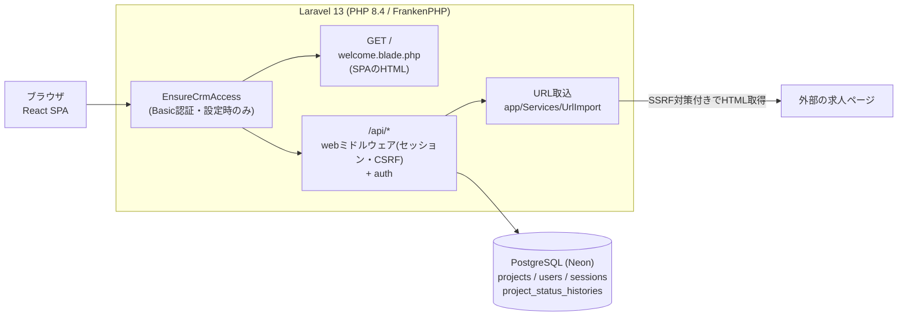
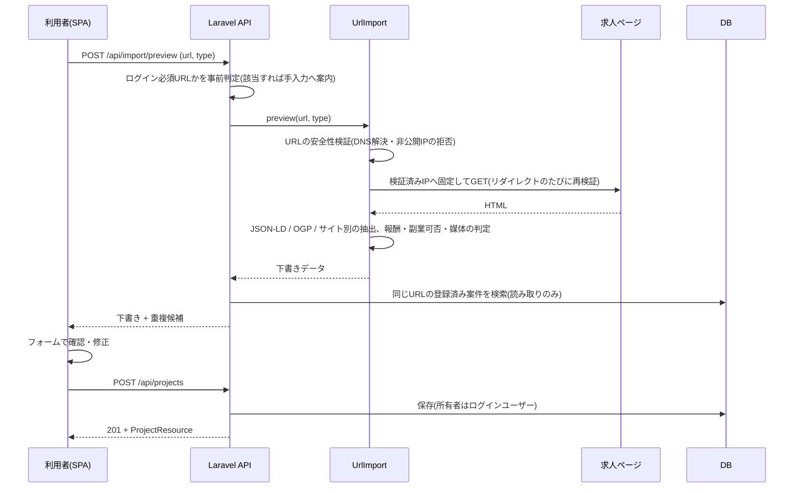
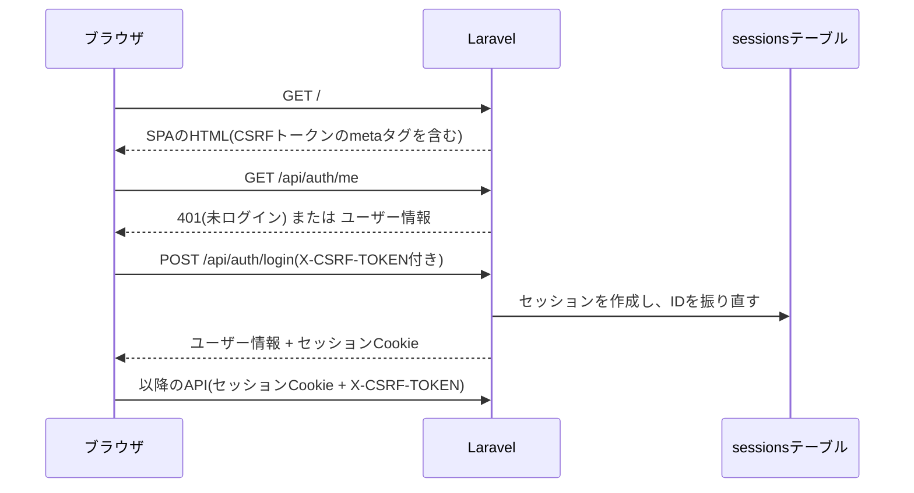

# JobHunt Architecture

JobHunt全体の構成と、主要な処理の流れを説明します。
何をするアプリかは [01-overview.md](01-overview.md) を参照してください。

## 1. 全体構成

JobHuntは、Laravelが1つのオリジンから「SPAのHTML」と「JSON API」の両方を返す構成です。
フロントエンド(React)とバックエンド(Laravel)は同じリポジトリにあり、本番では1つのDockerイメージとして動きます。



- 画面の切り替えはすべてReact側で行い、ルーター(URLごとのページ)は使っていません。HTMLを返すルートは `/` の1つだけです。
- APIは `routes/api.php` で定義し、すべて `web` ミドルウェアグループ(セッション・CSRF検証)を通します。トークン方式の認証(Sanctum等)は使っていません。
- ローカル開発とテストはSQLite、本番はPostgreSQL(Neon)です。

## 2. ディレクトリ構成(主要部分)

```
app/
  Http/Controllers/     AuthController, ProjectController, ProjectTrashController, ImportPreviewController
  Http/Requests/        入力検証(StoreProjectRequest, UpdateProjectRequest, ImportPreviewRequest, ...)
  Http/Resources/       APIの返却形式(ProjectResource)
  Http/Middleware/      EnsureCrmAccess(サイト全体のBasic認証)
  Models/               Project, ProjectStatusHistory, User
  Observers/            ProjectObserver(ステータス変更の履歴を記録)
  Services/UrlImport/   URL取込(安全な取得・HTML解析・項目抽出)
  Support/              ProjectStatus(種別ごとのステータス定義), SideJobAllowed
database/migrations/    テーブル定義とデータ移行
routes/api.php          JSON API
routes/web.php          SPAのHTML(GET /)
resources/views/        welcome.blade.php(SPAの入れ物)
resources/js/
  app.tsx               エントリポイント
  AppRoot.tsx           認証状態・一覧・絞り込み・各モーダルの状態をまとめる最上位コンポーネント
  ProjectModal.tsx      登録・編集フォーム
  components/           ProjectCard(一覧の行), ProjectDetailPanel(詳細), UrlImportModal, TrashView, AuthScreen
  api/                  fetchの薄いラッパー(apiFetch)とAPI呼び出し
  constants/            ステータス・媒体などの定義、デモ用の架空案件
  utils/                フォーム変換、並び替え、報酬・媒体の表示整形など
tests/                  PHPUnit(Feature / Unit)
.github/workflows/      GitHub Actions(CI)
Dockerfile              本番イメージ
```

## 3. フロントエンド

- **構成**: React 19 + TypeScript。状態管理ライブラリやルーターは使わず、`AppRoot` が `useState` で状態を持ち、子コンポーネントへ渡します。
- **API呼び出し**: `resources/js/api/projects.ts` の `apiFetch` がすべての通信の入口です。
  - `credentials: 'same-origin'` でセッションCookieを送る
  - `<meta name="csrf-token">` から読んだ値を `X-CSRF-TOKEN` ヘッダーに付ける
  - URL取込のように時間がかかる通信は、`AbortController` で打ち切る(上限20秒)
- **一覧の並び順**: APIは登録の新しい順で返し、画面側で「選考の進み具合 → 更新日時 → id」に並べ替えます(`utils/projectSort.ts`)。ページングは無く、ユーザーの案件をまとめて取得する前提です。
- **詳細表示**: 一覧の行を押すと `ProjectDetailPanel` を開きます。PC(md以上)では右側のパネル、スマートフォンでは下からのシートです。
- **デモ**: `constants/demoProjects.ts` の架空案件を画面内だけで表示し、APIは呼びません。
- **スタイル**: Tailwind CSS 4。UIの方針は [ui-guidelines.md](ui-guidelines.md) にまとめています。

## 4. バックエンド

役割ごとに次のように分けています。

| 層 | 役割 |
|---|---|
| Routes | URLとコントローラーの対応。認証が必要なAPIを `auth` ミドルウェアでまとめる |
| FormRequest | 入力検証。ステータスは「種別ごとに許可された値」だけを受け付ける |
| Controller | 所有者の確認、Modelの操作、Resourceでの返却。処理は小さく保つ |
| Resource | APIの返却形式を `ProjectResource` に一本化 |
| Model / Observer | `Project` の保存と、ステータス変更時の履歴記録(`ProjectObserver`) |
| Services/UrlImport | URL取込の取得・解析・抽出。DBには書き込まない |
| Support | `ProjectStatus` など、複数の場所で使う定義 |

ステータスの定義は、バックエンドの `app/Support/ProjectStatus.php` を正としています。
フロントエンドの `resources/js/constants/projectOptions.ts` にも選択肢として同じ定義があり、両者は手で同期しています。

## 5. 主要な処理の流れ

### 5.1 URL取込から登録まで

URL取込は「プレビュー(保存しない)」と「登録」の2段階に分かれています。
取り込んだ内容は必ず利用者がフォームで確認してから保存されます。



- 取得はサーバー側で行うため、SSRF(サーバーを踏み台にした内部ネットワークへのアクセス)対策を `UrlSafetyValidator` / `SafeHtmlFetcher` / `PinnedConnectionOptions` / `IpRangeGuard` で行っています。
- 取得の失敗は `error_code` 付きで返り、画面は種類に応じて「手入力で続ける」などの案内を出します。

### 5.2 一覧・詳細・更新

| 操作 | API | 画面側の処理 |
|---|---|---|
| 一覧表示・絞り込み | `GET /api/projects?type=&keyword=` | 受け取った配列を並べ替えて表示。件数の集計も画面側 |
| 詳細表示 | なし(一覧で取得済みのデータを使う) | 選択中の案件idから、一覧のデータを引き直して表示 |
| ステータスの直接変更 | `PATCH /api/projects/{id}`(`status` だけを送る) | 成功したら一覧を再取得し、一覧・詳細・集計をそろえる |
| 編集・活動メモ | `PATCH /api/projects/{id}`(フォームの内容) | 保存後に一覧を再取得。詳細パネルは開いたまま |
| ゴミ箱へ移動 | `DELETE /api/projects/{id}`(論理削除) | 一覧を再取得 |
| ゴミ箱・復元・完全削除 | `GET /api/projects/trash`、`POST /{id}/restore`、`DELETE /{id}/force` | ゴミ箱画面で操作 |

ステータスが変わったときは、`ProjectObserver` が `project_status_histories` に変更前後の値と日時を記録します(現在、履歴を表示する画面はありません)。

## 6. 認証・セッション・CSRF



- **認証**: Laravel標準の `web` ガード(セッション)。登録・ログイン・ログアウト・自分の情報取得の4つのAPIがあります。ログインと登録は、同じIPから1分間に6回までに制限しています。
- **セッション**: 本番は `sessions` テーブル(PostgreSQL)に保存します。サーバーレス環境ではインスタンス間でファイルを共有できないため、ファイル保存は使っていません。
- **CSRF**: 更新系のAPIは、`X-CSRF-TOKEN` ヘッダーのトークンが一致するか、ブラウザが付ける `Sec-Fetch-Site: same-origin` ヘッダーで同一オリジンからのリクエストと確認できる場合に受け付けます(Laravel 13 の `PreventRequestForgery`)。
- **Basic認証**: `EnsureCrmAccess` をすべてのリクエストの手前に置いています。`APP_ACCESS_PASSWORD` を設定したときだけ有効になり、ユーザーのログインとは別の、サイト全体の入口の保護です。

## 7. データの分離と認可

- 案件の取得・更新・削除は、すべて `Project::ownedBy(ログインユーザーのid)` で絞り込みます。
- 他のユーザーの案件を指定した場合は、403ではなく404を返します(案件が存在すること自体を知らせないため)。
- `user_id` はリクエストの値では設定できません。登録は `$request->user()->projects()->create()` で行い、所有者はログインユーザーに決まります。
- URL取込の重複チェックも、自分の案件だけを対象にします。

## 8. 本番環境とCI

### 本番

`Dockerfile` のマルチステージビルドで1つのイメージを作り、Vercel上で実行しています。

1. `node:24` で `npm ci` → `npm run build`(Viteでフロントエンドをビルド)
2. `composer:2` で本番用の依存だけをインストール(`--no-dev`)
3. `dunglas/frankenphp`(PHP 8.4)に、アプリ・依存・ビルド済みフロントエンドをまとめる

- 本番用の既定値として `APP_ENV=production`、`APP_DEBUG=false`、ログは標準エラー出力、セッションはDBを設定しています。
- `config:cache` はビルド時に実行しません。ビルド時には環境変数が無く、Basic認証のパスワードなどが空のまま固定されてしまうためです。
- 接続情報などの秘密情報はリポジトリに含めず、実行環境の環境変数で渡します。

### CI

`.github/workflows/ci.yml` で、main への push と pull request ごとに次を実行します。秘密情報は使いません。

| ジョブ | 内容 |
|---|---|
| Frontend | `npm ci` → Vitest → `tsc --noEmit` → `vite build` |
| Backend | PHP 8.4 → フロントエンドのビルド → `composer install` → テスト用の `.env` と鍵の生成 → PHPUnit(メモリ上のSQLite) |

Backendのジョブでもフロントエンドをビルドするのは、SPAのHTMLを返すテストがビルド済みの `manifest.json` を読み込むためです(本番のDockerfileと同じ順序)。

## 9. 設計上のトレードオフ(現状)

- `AppRoot.tsx` に、認証状態・一覧の取得・絞り込み・モーダル・デモ・通知の状態が集まっています。画面が1つで状態の受け渡しが単純な分、ファイルは大きくなっています。
- ステータスの定義はPHPとTypeScriptの両方にあり、変更するときは両方をそろえる必要があります(検証の正はPHP側)。
- 一覧の並び替えと集計は画面側で行っています。全件をまとめて取得する前提で、件数が大きく増えた場合はページングとサーバー側での並び替えが必要になります。
