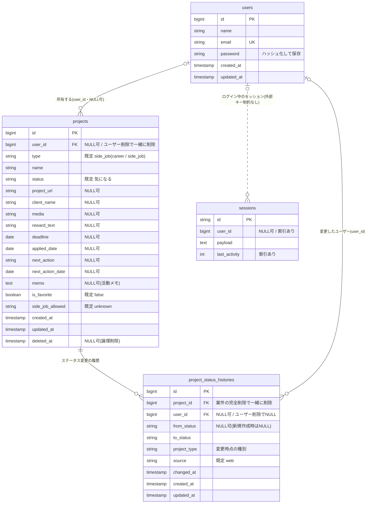

# JobHunt Database

JobHuntのデータベース構成を説明します。
内容は `database/migrations/` と `app/Models/` の現在の定義に基づいています。
全体の構成は [02-architecture.md](02-architecture.md) を参照してください。

## 1. 概要

| 環境 | DB |
|---|---|
| 本番 | PostgreSQL(Neon) |
| ローカル開発 | SQLite(`database/database.sqlite`) |
| テスト | SQLite(メモリ上。`phpunit.xml` で指定) |

アプリケーションが使うテーブルは、`users`・`projects`・`project_status_histories` の3つです。
このほかに、Laravel標準の `sessions`・`password_reset_tokens`・`cache`・`jobs` などがあります(本番ではセッションを `sessions` テーブルに保存しています)。

## 2. ER図

図では `projects` の主要な列だけを示しています。全列は次の章の表のとおりです。

## 3. テーブル

### 3.1 users

Laravel標準の構成です(`0001_01_01_000000_create_users_table.php`)。

- `email` は一意(UNIQUE)
- `password` はModelの `hashed` キャストでハッシュ化して保存し、APIの返却には含めない(`#[Hidden]`)
- プランや権限などの独自の列はありません

### 3.2 projects

求人・案件の本体です。最初の `create_projects_table` に、種別・論理削除・種別専用項目・所有者などの列を後から追加してきました。

| 区分 | 列 | 型 | NULL | 既定値 | 備考 |
|---|---|---|---|---|---|
| キー | `id` | bigint | — | 自動採番 | 主キー |
| | `user_id` | bigint | 可 | — | `users.id` への外部キー。ユーザーを削除すると案件も削除(cascade) |
| 基本 | `type` | string | 不可 | `side_job` | `career`(転職) / `side_job`(副業) |
| | `name` | string | 不可 | — | 案件名 |
| | `status` | string | 不可 | `気になる` | 選択肢は種別ごとに異なる(4章) |
| | `project_url` | string | 可 | — | 求人ページのURL |
| | `client_name` | string | 可 | — | 会社・クライアント名 |
| | `media` | string | 可 | — | 媒体(type・CrowdWorks・その他など) |
| | `category` | string | 可 | — | カテゴリ |
| | `description` | text | 可 | — | 募集内容 |
| 条件 | `reward_text` | string | 可 | — | 報酬の表記(例: 年収600万円〜、応相談)。画面はこちらを優先して表示 |
| | `reward` | integer | 可 | — | 報酬の数値。`reward_text` 追加前からある列で、互換のため残している |
| | `working_hours` | string | 可 | — | 稼働時間 |
| | `applicant_count` | integer | 可 | — | 応募人数 |
| | `recruitment_count` | integer | 可 | — | 募集人数 |
| 日付 | `deadline` | date | 可 | — | 応募締切 |
| | `applied_date` | date | 可 | — | 応募日 |
| | `fetched_at` | timestamp | 可 | — | URL取込で取得した日時 |
| 管理 | `next_action` | string | 可 | — | 次にすること |
| | `next_action_date` | date | 可 | — | 次にすることの予定日(時刻は持たない) |
| | `memo` | text | 可 | — | 活動メモ(自由記述) |
| | `application_text` | text | 可 | — | 応募文 |
| | `is_favorite` | boolean | 不可 | `false` | お気に入り |
| | `priority` | string | 可 | — | 初期からある列。現在の画面では入力・表示していない |
| 転職専用 | `job_type` | string | 可 | — | 職種 |
| | `location` | string | 可 | — | 勤務地 |
| | `remote_type` | string | 可 | — | リモート区分 |
| | `employment_type` | string | 可 | — | 雇用形態 |
| | `side_job_allowed` | string | 不可 | `unknown` | 副業可否(`ok` / `ng` / `unknown`) |
| 副業専用 | `contract_type` | string | 可 | — | 契約形態 |
| | `delivery_date` | date | 可 | — | 納品日 |
| 記録 | `created_at` / `updated_at` | timestamp | 可 | — | Laravel標準 |
| | `deleted_at` | timestamp | 可 | — | 論理削除の日時(5章) |

**索引**(`2026_09_21_000100_add_indexes_to_projects_table.php`)

| 索引名 | 列 | 対応するクエリ |
|---|---|---|
| `projects_user_id_deleted_at_created_at_index` | `user_id, deleted_at, created_at` | 一覧・ゴミ箱(自分の案件を、論理削除の有無で絞り、登録日順に並べる) |
| `projects_user_id_type_index` | `user_id, type` | 種別での絞り込み |
| `projects_user_id_status_index` | `user_id, status` | ステータスでの絞り込み |

すべてのクエリが `user_id` で絞り込まれるため、どの索引も `user_id` を先頭にしています。

### 3.3 project_status_histories

ステータス変更の履歴です(`2026_09_21_000200_create_project_status_histories_table.php`)。

| 列 | 型 | NULL | 既定値 | 備考 |
|---|---|---|---|---|
| `id` | bigint | — | 自動採番 | 主キー |
| `project_id` | bigint | 不可 | — | `projects.id` への外部キー。案件を完全削除すると履歴も削除(cascade) |
| `user_id` | bigint | 可 | — | 変更したユーザー。ユーザーを削除するとNULLになる(nullOnDelete) |
| `from_status` | string | 可 | — | 変更前。新規作成時はNULL |
| `to_status` | string | 不可 | — | 変更後 |
| `project_type` | string | 不可 | — | 変更時点の種別。後から種別が変わっても、どちらの体系での変更か分かる |
| `source` | string | 不可 | `web` | 変更の出所。現在は常に `web` |
| `changed_at` | timestamp | 不可 | — | 変更が起きた日時 |
| `created_at` / `updated_at` | timestamp | 可 | — | Laravel標準 |

索引: `(project_id, changed_at)`、`(user_id, changed_at)`。

## 4. ステータスと種別

ステータスはDBでは単なる文字列で、DB側の制約(CHECK制約やenum)はありません。
許可する値は `app/Support/ProjectStatus.php` で定義し、登録・更新のAPIで「その案件の種別で許可された値か」を検証します。

| 種別 | ステータス |
|---|---|
| 転職(`career`) | 気になる / 応募準備 / 応募済み / 書類選考 / 面接 / 最終面接 / 内定 / 見送り |
| 副業(`side_job`) | 気になる / 応募準備 / 応募済み / 返信待ち / 面談 / 選考中 / 契約 / 作業中 / 納品 / 検収待ち / 完了 / 見送り |

- 副業の旧名称(未応募・面談予定・契約済み・納品済み・不採用・辞退)は、`2026_08_22_010500_migrate_legacy_side_job_status_labels.php` で新名称へデータ移行しました。登録・更新のAPIでも、副業の案件に旧名称が送られた場合は新名称へ読み替えます。
- `type` と `side_job_allowed` も同様に、DBでは文字列で、許可する値はアプリ側で検証しています。

## 5. 論理削除(ゴミ箱)

`projects` はLaravelの `SoftDeletes` を使い、削除しても行を消さずに `deleted_at` に日時を入れます。

| 操作 | DBへの影響 |
|---|---|
| ゴミ箱へ移動 | `deleted_at` に日時を設定。通常の一覧からは自動的に除外される |
| 復元 | `deleted_at` をNULLに戻す |
| 完全削除 | 行を物理的に削除。外部キーの cascade により、その案件のステータス履歴も削除される |

- ステータス履歴は、ゴミ箱に入っている間は残ります。完全削除したときだけ一緒に消えます。
- URL取込の重複チェックは、ゴミ箱に入っている案件を対象にしません。

## 6. ステータス履歴の記録方法

履歴は `app/Observers/ProjectObserver.php` が、Eloquentのイベントで自動的に書き込みます。

- 新規作成時: `from_status` をNULLとして、初期ステータスを記録する
- 更新時: ステータスが実際に変わったときだけ記録する(他の項目の更新や、同じ値での保存では記録しない)
- 変更したユーザーはログイン中のユーザー。ログインしていない処理(CLIなど)では案件の所有者を記録する

コードに明記されている制約は次のとおりです。

- Eloquentを経由しない更新(クエリビルダでの一括更新、migrationでのデータ移行)は記録されない
- 案件の保存と履歴の書き込みは同じトランザクションではない(履歴の書き込みに失敗すると、案件だけが更新された状態になる)
- 履歴テーブルの作成より前の変更は記録されていない(推測で過去分を作らない方針)

現在、履歴を表示する画面やAPIはありません。

## 7. ユーザーごとのデータ分離

- `projects.user_id` が所有者です。すべての取得・更新・削除は `Project::ownedBy(ログインユーザーのid)` を通して行います。
- `user_id` はモデルの代入可能な項目(`$fillable`)に含めていません。登録は `User::projects()` 経由で行い、所有者を必ずログインユーザーにします。
- `user_id` がNULLの行(ユーザー分離を入れる前に作られた開発データ)は、どのユーザーからも見えません。migrationではこれらを自動で修復していません。

## 8. 設計上の判断とトレードオフ

migrationやモデルのコメント、定義から確認できるものです。

- **値の制約はアプリ側で持つ**: ステータス・種別・副業可否はDBの制約ではなく、APIの入力検証で守っています。種別ごとにステータスの選択肢が変わるため、検証をアプリ側の定義(`ProjectStatus`)に一本化しています。その分、アプリを経由しない書き込みでは値が保証されません。
- **副業可否は3値で、NULLを使わない**: 既定値を `unknown` にして、「記載なし」「取得失敗」「既存の行」をすべて同じ値で表しています(NULLと `unknown` の2種類の「不明」を作らないため)。
- **報酬は表記を優先**: 求人の報酬は「年収600万円〜900万円」「応相談」のように数値化できない表記が多いため、表記を `reward_text` にそのまま保存し、表示もこちらを優先します。数値の `reward` は互換のために残しています。
- **DBの既定値と画面の既定値が異なる**: `status` のDB既定値は「気になる」、`type` は `side_job` です(初期は副業専用のアプリだったため)。現在の画面からの登録では、ステータス(既定「応募済み」)と種別を必ず送るので、DBの既定値は使われません。
- **履歴は案件と一緒に消える**: 完全削除のときに履歴を残さない(孤児レコードを作らない)方針です。そのため、完全削除した案件の履歴は追えません。
- **時刻を持たない日付**: `next_action_date`・`deadline` などは `date` 型で、面接の時刻は保存できません。
- **URL列の長さ**: `project_url` は `string`(Laravelの既定で最大255文字)で作られていますが、入力検証は2048文字まで許可しています。PostgreSQLでは255文字を超えるURLの保存が失敗する可能性があり、コード上の不一致として残っています。
