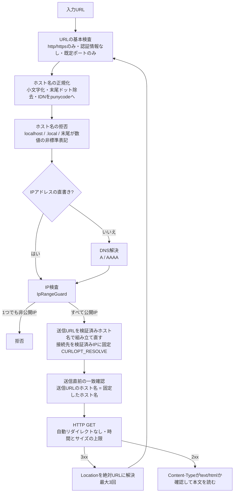

# URL取込のSSRF対策

JobHuntのURL取込で、サーバーが「外部の求人ページ」以外へ接続しないようにしている仕組みを説明します。
内容は `app/Services/UrlImport/` の現在のコードと、関連するテストに基づいています。
APIとしての入出力は [04-api.md](04-api.md) を参照してください。

## 1. なぜSSRFのリスクがあるのか

URL取込では、利用者が入力したURLへ**サーバーが**HTTPリクエストを送ります。
何も対策しないと、利用者はサーバーを踏み台にして、外部からは届かない場所へリクエストを送らせることができます(SSRF: Server-Side Request Forgery)。

- `http://127.0.0.1/` や `http://localhost/` … サーバー自身
- `http://10.0.0.5/`、`http://192.168.1.1/` … 内部ネットワークの機器
- `http://169.254.169.254/` … クラウドのメタデータ(認証情報が取れる場合がある)

URLの文字列を見るだけでは防げません。普通のドメイン名でも、DNSの答えが内部のIPを指していることがあるためです。
そこでJobHuntは「最終的に接続するIPアドレス」を基準に判定し、判定したIPにだけ接続するようにしています。

## 2. 安全な取得フロー

各段階でどれか1つでも条件を満たさなければ、その時点で拒否し、HTTP通信は行いません。

## 3. 防御の層

| 層 | クラス | 役割 |
|---|---|---|
| URLの検証 | `UrlSafetyValidator` | URLの基本検査、ホスト名の正規化と拒否、DNS解決、解決したすべてのIPの検査。検証済みのホスト名・IP一覧を返す |
| IPの判定 | `IpRangeGuard` | IPが非公開・予約済みの範囲かを判定する。検証時と接続直前の両方で使う |
| 接続先の固定 | `PinnedConnectionOptions` | cURLの `CURLOPT_RESOLVE` に「ホスト名:ポート:検証済みIP」を渡す。ここでもIPを再検査する |
| 取得 | `SafeHtmlFetcher` | 送信URLの組み立て直しと一致確認、リダイレクトの手動処理、時間・サイズ・Content-Typeの検査 |

## 4. 脅威ごとの整理

| 脅威 | 修正前の問題 | 現在どこで防ぐか |
|---|---|---|
| `file:` / `ftp:` などのスキーム、URL内の認証情報、任意のポート | — | `UrlSafetyValidator`: http/httpsのみ、`user:pass@` は拒否、ポートは80/443のみ |
| `localhost`、`*.local` | — | `UrlSafetyValidator`: 正規化後のホスト名で拒否 |
| 非公開IPの直書き(`127.0.0.1`、`10.x`、`169.254.169.254`、`[::1]` など) | — | `IpRangeGuard` |
| 普通のドメイン名が、DNSで非公開IPに解決される | — | DNSで解決した**すべての**IPを `IpRangeGuard` で検査し、1つでも該当すれば拒否 |
| DNS rebinding(検証時と接続時でDNSの答えを変える) | — | 検証したIPに接続先を固定(`CURLOPT_RESOLVE`) |
| 末尾ドット付きのホスト名(`example.com.`) | **固定が効かず、cURLが自分でDNSを引き直していた**(5.4) | 送信URLを検証済みのホスト名で組み立て直し、送信直前に一致を確認 |
| 外部サイトから内部へのリダイレクト | — | 自動リダイレクトを無効にし、移動先ごとに最初から検証し直す(最大3回) |
| Unicode / 全角のホスト名(`日本語.example`、`ｌｏｃａｌｈｏｓｔ`) | 送信前にGuzzleが拒否し、日本語ドメインのURLを取り込めなかった | punycodeへ正規化してから検証・送信する。全角の `ｌｏｃａｌｈｏｓｔ` は正規化で `localhost` になり拒否 |
| 非標準の数値表記(`2130706433`、`127.1`、`0x7f.1`) | 検証側はDNS名、cURLはIPv4として解釈していた(5.6) | 末尾が数値のホスト名を、DNS解決より前に拒否 |
| IPv4互換IPv6(`[::127.0.0.1]`) | IP検査を通過していた | `IpRangeGuard` で `::/96` を拒否 |
| 巨大な応答・応答しないサーバー | — | 本文2MBまで(展開後)、接続3秒・1リクエスト6秒・全体15秒 |
| HTML以外の応答 | — | `Content-Type` が `text/html` 以外は拒否 |

「修正前の問題」は、2026年10月の見直し(commit `f0188ea`)で見つけて直したものです。

## 5. 仕組みの詳細

### 5.1 ホスト名の正規化

`UrlSafetyValidator::normalizeHost()` は、拒否リストとの照合とDNS解決の前に、ホスト名を次のようにそろえます。

1. 小文字にし、IPv6の `[ ]` を外す
2. 末尾のドットを取り除く(`localhost.` → `localhost`)
3. IPアドレスでなければ、`idn_to_ascii`(UTS46)でpunycodeに変換する

表記のゆれで拒否リストをすり抜けられないようにするためです。
`idn_to_ascii` はPHPのintl拡張が無くても、依存関係の `symfony/polyfill-intl-idn` が提供するため、常に変換されます。

### 5.2 DNS解決とIPの検査

- ホスト名は `dns_get_record` でA / AAAAレコードを引き、得られた**すべての**IPを検査します。公開IPと非公開IPが混ざっていても拒否します(接続先をcURLに選ばせないため)。
- 解決できなければ `dns_resolution_failed` で拒否します。
- `IpRangeGuard` が拒否する主な範囲:

| 種類 | 範囲 |
|---|---|
| IPv4 | `0.0.0.0/8`、`10.0.0.0/8`、`100.64.0.0/10`(CGNAT)、`127.0.0.0/8`、`169.254.0.0/16`、`172.16.0.0/12`、`192.168.0.0/16`、TEST-NET、`198.18.0.0/15`、マルチキャスト、`240.0.0.0/4` など |
| IPv6 | `::1`、`::`、`::/96`(IPv4互換)、`64:ff9b::/96`(NAT64)、`fc00::/7`、`fe80::/10`、`ff00::/8`、`2001:db8::/32` など |
| IPv4射影IPv6 | `::ffff:a.b.c.d` は、埋め込まれたIPv4を取り出して上の表で判定 |

解釈できないIP文字列は、安全側に倒して「拒否」と判定します。

### 5.3 接続先の固定と CURLOPT_RESOLVE

検証でDNSを引き、接続時にもう一度DNSを引くと、2回の間に答えが変わる可能性があります(DNS rebinding)。
攻撃者が管理するDNSなら、1回目は公開IP、2回目は `127.0.0.1` を返すことができます。

そこで `PinnedConnectionOptions` が、cURLの `CURLOPT_RESOLVE` に `example.com:443:93.184.216.34` のような「ホスト名:ポート:検証済みIP」を登録します。
cURLはそのホスト名について自分でDNSを引かず、登録されたIPへ接続します。
`CURLOPT_RESOLVE` は名前解決だけを差し替える機能なので、URL・Hostヘッダー・HTTPSの証明書検証はIPアドレスではなくホスト名のまま行われ、通常のHTTPSとして動きます。

ただし `CURLOPT_RESOLVE` は、**cURLが使うホスト名と、登録したホスト名が文字列として一致したとき**しか効きません。一致しなければ、cURLは何も言わずに自分でDNSを引きます。これが次の不具合の原因でした。

### 5.4 末尾ドットで見つけた不一致と、その修正

**見つけた問題**

- 検証では `example.com.` の末尾ドットを取り除き、`example.com` として解決・検査し、接続先も `example.com:443:IP` で固定していました。
- 一方、HTTPクライアントには入力どおりの `https://example.com./job` を渡していました。
- cURLから見ると、使うホスト名は `example.com.`、固定されているのは `example.com` で、一致しません。そのため固定が無視され、cURLが自分でDNSを引き直していました。
- 当時、ローカルのcURL 8.21.0で実測したところ、`localhost` を到達不能なIP(203.0.113.5)に固定した状態でも、`localhost.` へのリクエストは固定を無視し、OSが解決した `[::1]` と `127.0.0.1` へ接続を試みました。
- 攻撃者がDNSの答えを切り替えられれば、検証を通過したあとで内部のIPへ接続させられる状態でした(ログインが前提)。

**修正**(`SafeHtmlFetcher`)

- `buildRequestUrl()`: 送信するURLのホスト名を、検証済みのホスト名に差し替えます。GuzzleのURL部品(`Uri::withHost()`)を使い、scheme・パス・クエリ・ポートはそのまま残し、fragmentは外します。
- `assertRequestTargetsVerifiedHost()`: 送信の直前に「送信URLのホスト名 = 固定したホスト名」を確認し、違えば通信せずに `invalid_url` で拒否します。組み立てで一致は保証されますが、将来の変更で元のURLを渡してしまっても安全側に倒れるよう、送信の入口に不変条件として置いています。

この修正で、末尾ドット・大文字・Unicode・全角のどの表記でも、cURLが使うホスト名は固定したホスト名と一致します。

### 5.5 Unicode / IDN / punycode

- 正規化で `日本語.example` は `xn--wgv71a119e.example` になり、このpunycodeで解決・検査・接続先の固定・送信まで行います。
- 修正前は、入力どおりのUnicodeのホスト名をHTTPクライアントに渡していました。Guzzle 7.15.3 はASCII以外のホスト名を送信前に拒否するため、安全側に倒れてはいたものの、日本語ドメインのURLは取り込めませんでした(502)。

### 5.6 非標準の数値表記のホスト名

`2130706433`、`017700000001`、`0x7f000001`、`0x7f.1`、`127.1`、`127.0.1`、`0177.0.0.1` は、cURLやブラウザがIPv4アドレス(いずれも `127.0.0.1`)として解釈します。

- 修正前、検証側はこれらを普通のDNS名として扱っていました。公開DNSでは解決できないため実際には拒否されていましたが、もしDNSが公開IPを返せば、検証は通過し、cURLは固定を使わずに `127.0.0.1` へ直接接続する状態でした(安全性がDNSの環境に依存していた)。
- 現在は、標準形式のIPアドレスではなく、**最後のラベルが数値(10進数、または `0x` で始まる16進数)** のホスト名を、DNS解決の前に `invalid_url` で拒否します。ブラウザのURL仕様(WHATWG URL Standard)の「ends in a number」と同じ判定で、数字だけのトップレベルドメインは存在しないため、`123.example.com` などの普通のホスト名は対象になりません。
- 標準形式のIPv4(`93.184.216.34`)は、これまでどおり `IpRangeGuard` で判定します。

### 5.7 IPv6

- IPv4射影アドレス(`::ffff:127.0.0.1`)は、埋め込まれたIPv4を取り出して判定し、拒否します。
- IPv4互換アドレス(`::127.0.0.1`、RFC 4291で非推奨)は、以前はIP検査を通過していました。現在は `::/96` をブロック対象に加えて拒否します。

### 5.8 リダイレクトごとの再検証

- HTTPクライアントの自動リダイレクトは無効(`allow_redirects => false`)です。
- 3xxの応答を受け取ったら、`Location` を絶対URLに直し、**最初の検証からやり直します**(正規化・DNS・IP検査・接続先の固定・一致確認)。
- 公開サイトから `http://169.254.169.254/` や、内部IPに解決されるホスト名へリダイレクトされても、ここで拒否されます。
- リダイレクトは最大3回で、超えると `too_many_redirects` で拒否します。

### 5.9 fail closed(判断できないときは拒否する)

判断に必要な情報が欠けたり、想定外の状態になったりしたときは、通信せずに拒否します。

| 場面 | 結果 |
|---|---|
| URLを解析できない、ホスト名が無い | `invalid_url` |
| DNSで1件も解決できない | `dns_resolution_failed` |
| IP文字列を解釈できない | `IpRangeGuard` が「拒否」と判定 |
| 接続先の固定に使える公開IPが1つも無い | `blocked_host`(`PinnedConnectionOptions` での再検査) |
| 送信URLを組み立て直せない、またはホスト名が固定と一致しない | `invalid_url`(通信しない) |
| 予期しない例外 | `500 internal_error`(内部の詳細は返さない) |

## 6. 回帰テスト

URL取込に関係する主なテストファイルです(2026年10月時点、すべて通過)。

| ファイル | 件数 | 主な確認内容 |
|---|---|---|
| `tests/Unit/Services/UrlImport/UrlSafetyValidatorTest.php` | 61 | スキーム・ポート・認証情報、非公開IPv4 / IPv6、DNSの解決結果、末尾ドット、Unicode・全角・punycode、非標準の数値表記(DNSに問い合わせないことも確認)、IPv4互換 / 射影IPv6 |
| `tests/Unit/Services/UrlImport/SafeHtmlFetcherTest.php` | 28 | 接続先の固定、自動リダイレクトの無効化、送信URLの組み立て直し(末尾ドット・大文字・Unicode・全角・ポート・fragment・IPv4 / IPv6)、固定したホスト名との一致、元のURLの送信を拒否すること |
| `tests/Unit/Services/UrlImport/PinnedConnectionOptionsTest.php` | 6 | `CURLOPT_RESOLVE` の組み立て、非公開IPを固定先から除くこと |
| `tests/Feature/UrlImportPreviewApiTest.php` | 69 | APIの入口から: 非公開IPの拒否、リダイレクト先の再検証、末尾ドット・Unicodeでの送信URL、数値表記の拒否と通信しないこと、エラーの分類、サイズ・Content-Type(このほか、HTMLから項目を読み取るテストも含む) |
| `tests/Feature/UrlImportTimeoutTest.php` | 3 | 時間の上限と、リダイレクトをまたいだ全体の上限 |

件数はデータの組み合わせ(data provider)を展開した数です。
テストは偽のDNS(`tests/Support/FakeHostResolver.php`)と `Http::fake()` を使い、実際のDNSや外部サイトには接続しません。
cURLの実際の接続の動き(5.4の実測)は単体テストでは再現できないため、送信URLのホスト名と固定したホスト名が一致することを、組み立てと一致確認の両方でテストしています。

## 7. 対象外・残課題

現在対策していないもの、またはこの資料の範囲外のものです。

- **6to4(`2002::/16`)・Teredo(`2001::/32`)** に埋め込まれたIPv4の判定はしていません。(IPv4側の `192.88.99.0/24` は拒否対象ですが、IPv6の `2002::/16` は対象外です。)
- **URL取込APIの回数制限** はありません。ログイン済みの利用者は、取得を繰り返し実行できます(ログイン・登録のAPIのみ1分6回の制限あり)。
- **本番環境での実測** はしていません。5.4・5.6の挙動はローカル(cURL 8.21.0・Guzzle 7.15.3)で確かめたものです。現在の対策は、cURLのIDN対応や末尾ドットの扱いに依存しない作りにしています。
- 取得失敗時のログに、入力されたURLをクエリ文字列ごと記録しています。

## 8. 面接前の要点

- サーバーが利用者のURLへ接続するので、**接続先のIP**で判定する(文字列ではなく)
- DNSで解決した**すべての**IPを検査し、検証した**そのIPにだけ**接続する(`CURLOPT_RESOLVE`)
- 接続先の固定は、cURLのホスト名と文字列が一致しないと効かない。末尾ドットでそれが崩れていたのを見つけ、**送信URLを検証済みのホスト名で組み立て直し、送信直前に一致を確認する**ように直した
- cURLが別の意味に解釈する表記(数値表記のホスト名・IPv4互換IPv6)は、検証の段階で拒否する
- リダイレクトは自分で処理し、移動先ごとに最初から検証する。判断できないときは通信せずに拒否する
