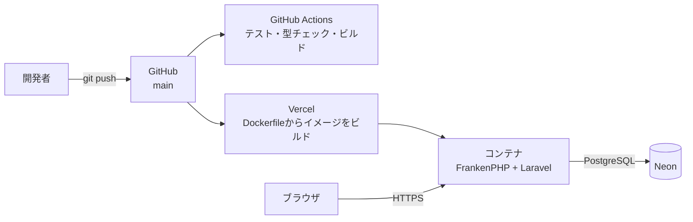

# JobHunt Deployment

JobHuntの本番環境の構成と、デプロイに関わる設定・判断を説明します。
内容は `Dockerfile`・`.dockerignore`・`config/`・`.env.example` と、Git履歴で確認できる範囲に基づいています。
Vercel・Neon側の管理画面の設定は、リポジトリからは確認できないため、確認できたものだけを書いています。

## 1. 構成

| 要素 | 内容 | 根拠 |
|---|---|---|
| 実行環境 | Vercel のコンテナ。ルートの `Dockerfile` からビルドする | commit `bc5ada7` の記録(Framework PresetがContainer、Build Command未設定のため、ルートのDockerfileでビルドされる) |
| Webサーバー | FrankenPHP(PHP 8.4)。Laravelと静的ファイルを1つのコンテナで配信する | `Dockerfile` |
| DB | PostgreSQL(Neon) | `config/database.php`、`.env.example`、commit `85b39c9` |
| CI | GitHub Actions | `.github/workflows/ci.yml` |

GitHubへのpushからVercelのデプロイがどう起動されるか(自動デプロイの設定など)は、リポジトリからは確認できません。

## 2. Dockerイメージ

`Dockerfile` は3段階のマルチステージビルドです。

| 段階 | ベースイメージ | 内容 |
|---|---|---|
| frontend | `node:24-bookworm-slim` | `npm ci` → `npm run build`。Viteで `public/build/` を作る |
| vendor | `composer:2` | `composer install --no-dev --optimize-autoloader`。本番用の依存だけを入れる |
| 実行 | `dunglas/frankenphp:1-php8.4-bookworm` | `pdo_pgsql` 拡張を追加し、本番用の `php.ini` を使う。アプリ・`vendor`・`public/build` をまとめる |

実行段階では、次の準備もしています。

- `bootstrap/cache/*.php` を削除する(手元のキャッシュをイメージに持ち込まない)
- `storage` と `bootstrap/cache` のディレクトリを作り、書き込み権限を付ける
- `php artisan view:cache` で Blade を事前にコンパイルする(書き込みできないファイルシステムでも動くように)
- 起動時に `SERVER_NAME` を `:${PORT:-80}` にして FrankenPHP を起動する(プラットフォームが渡す `PORT` で待ち受ける)

`.dockerignore` で、`.env`・`.git`・`node_modules`・`vendor`・`public/build`・`tests`・作業用ディレクトリ(`.kiro`・`.claude` など)をイメージに含めないようにしています。`vendor` と `public/build` は、イメージの中でビルドしたものだけを使います。

## 3. 本番の設定

### イメージに組み込んでいる既定値

`Dockerfile` の `ENV` で、秘密情報を含まない既定値だけを設定しています。

| 変数 | 値 | 理由 |
|---|---|---|
| `APP_ENV` / `APP_DEBUG` | `production` / `false` | エラーの詳細を利用者に見せない |
| `LOG_CHANNEL` | `stderr` | ログを標準エラー出力へ出し、プラットフォーム側で見る |
| `SESSION_DRIVER` | `database` | セッションを `sessions` テーブル(Neon)に保存する |
| `CACHE_STORE` | `array` | 永続的なキャッシュを使わない |
| `QUEUE_CONNECTION` | `sync` | キューを使わず、その場で処理する |

### 実行環境で渡す環境変数

秘密情報はリポジトリに含めず、実行環境の環境変数で渡します。`.env.example` のコメントと設定ファイルから、本番で使う変数は次のとおりです(値はここには書きません)。

| 変数 | 用途 |
|---|---|
| `APP_KEY` | 暗号化・セッションの鍵 |
| `APP_URL` | アプリのURL |
| `DB_CONNECTION` | `pgsql` |
| `DATABASE_URL`(または `DB_URL`) | Neonの接続文字列。`config/database.php` の `pgsql` は `DB_URL` が無ければ `DATABASE_URL` を使う |
| `SESSION_SECURE_COOKIE` | HTTPSで配信するため、セッションCookieにSecure属性を付ける |
| `APP_ACCESS_USER` / `APP_ACCESS_PASSWORD` | アプリ本体とAPIのBasic認証(公開LPは対象外)。パスワードが空なら無効。本番では設定しない |

実際にVercelでどの値が設定されているかは、リポジトリからは確認できません。

## 4. 設計上の判断

### セッションをDBに保存する

サーバーレスのコンテナでは、インスタンス間でファイルを共有できないため、Laravel既定のファイル保存は使えません。
Cookieに保存する方法でもセッションは維持できますが、サーバー側から無効にできないため、`sessions` テーブルに保存しています(commit `85b39c9`)。
`sessions` テーブルはLaravel標準のmigrationで作られるため、追加のmigrationは不要です。

### ビルド時に config:cache を実行しない

`config:cache` は、設定値を1つのファイルに固定して読み込みを速くする機能です。
ビルドの時点では環境変数が無いため、ここで実行すると `APP_ACCESS_PASSWORD` などが空のまま固定されます。その結果、Basic認証が何のエラーも出さずに無効になります(commit `85b39c9` で実測して確認)。

- `Dockerfile` に、ビルド時に `config:cache` を実行してはいけないことを警告として書いています。
- 環境変数は `config/access.php` の中でだけ読み、ミドルウェアは `config('access.*')` を使います。キャッシュした状態でも正しく動くことを `EnsureCrmAccessTest` で確認しています。

### リバースプロキシの後ろで動かす

TLS(HTTPS)はプラットフォーム側で終端されるため、`bootstrap/app.php` で `trustProxies(at: '*')` を設定し、`X-Forwarded-*` ヘッダーを信頼しています。
これが無いと、Laravelがhttpsと判定できず、生成するURLやクライアントのIPが誤ります。
ただし、プロキシを通さずに直接アクセスできる環境では、このヘッダーを偽装される余地があります。

### Basic認証による入口の保護

`EnsureCrmAccess` をすべてのリクエストの手前に置き、URLを知っているだけの第三者が到達しないようにする仕組みです。
ただし、ログイン前の閲覧者に向けた公開LP(`/` への GET・HEAD)だけは対象外にしています。有効にした場合は、アプリ本体(`/app`)とAPIが対象になります。
本番ではこの仕組みを使っていません。`/` を公開LP、`/app` をログイン画面とアプリ本体とし、アプリ本体とAPIはログイン(セッション認証)で保護する構成を正式な公開方法としています。
利用者を個別に識別するものではないため、アプリのログイン(ユーザーごとのデータ分離)の代わりにはなりません(`config/access.php` のコメント)。

## 5. デプロイ前の確認

本番のビルドは、リポジトリの内容だけを使う、手元とは別のクリーンな環境で行われます。
過去に、手元では動いていたのに、Vercelのビルドだけが失敗したことがあります。commitに含め忘れた(未追跡の)ファイルを、コードが読み込んでいたためです(commit `d193700` のビルドが失敗し、`7137492` で不足していたファイルを追加して修正)。

このため、pushの前に次を確認しています。

| 確認 | コマンド・方法 |
|---|---|
| 未追跡・未commitのファイルに依存していないか | `git status` で、必要なファイルがすべてcommitされているか |
| テスト | `npm run test`、`php artisan test`(終了コードで判定) |
| 型・ビルド | `npx tsc --noEmit`、`npm run build` |
| 空白・改行の問題 | `git diff --check` |

pushすると、GitHub Actionsのクリーンな環境で同じテスト・型チェック・ビルドが実行されます。

## 6. リポジトリから確認できないこと・残課題

- **本番DBへのmigrationの実行方法**: `Dockerfile` の起動処理やCIには、migrationを実行する手順がありません(`composer.json` の `migrate` はローカルの初期設定用)。本番での実行手順は、リポジトリ内に定義されていません。
- **Vercelのデプロイの起動条件・ドメイン・環境変数の設定値**: 管理画面の設定のため、リポジトリからは確認できません。
- **ヘルスチェック**: Laravel標準の `/up` がありますが、プラットフォーム側で使っているかは確認できません。
- **本番環境での実測**: URL取込のcURLの挙動などは、ローカルで確認したものです([05-url-import-security.md](05-url-import-security.md))。
